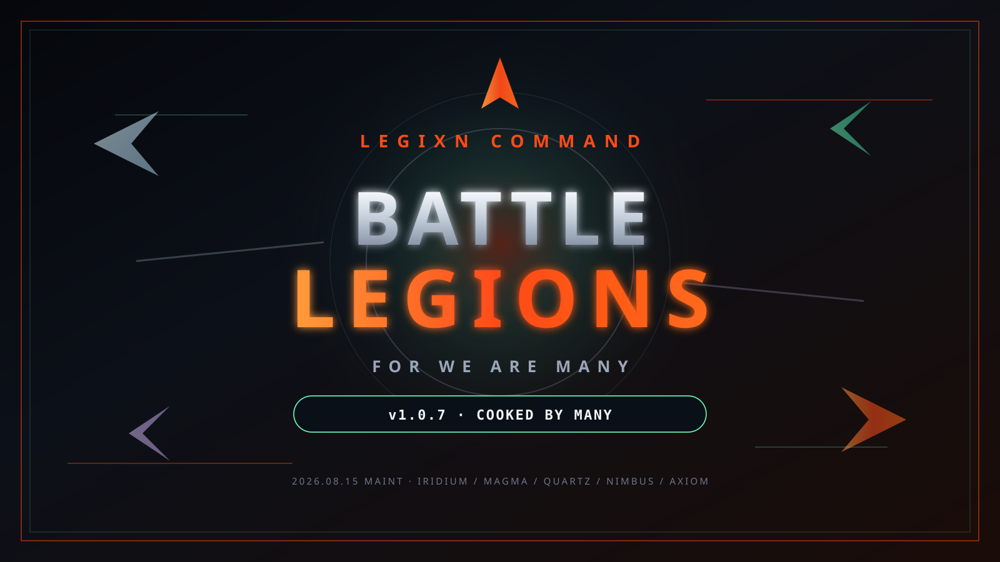

# Battle Legions: For We Are Many

  

> Offline collectible card combat where high-tech legions fight with medieval physics, lasers, and math that actually tells you the truth.

Welcome, commander. This is the short, slightly sarcastic field manual for **Battle Legions: For We Are Many** — a Hearthstone-shaped command flow dressed in power weapons, discombobulator beams, and live lethal math. No accounts. No cloud. Just your legion, your tickets, and whatever AI leetspeak name is about to learn respect.

---

## Download the game (v1.06.666)

**Direct APK (recommended):**  
**[Download BattleLegions.apk — Release 1.06.666](https://github.com/l3g1Xn/bl-feam-og/releases/download/apk-release-1.06.666/BattleLegions.apk)**

- **Size:** ~116 MB (TraX included · 350 MB hard cap)
- **Platform:** Android (signed offline package, landscape)
- **Release page:** [apk-release-1.06.666](https://github.com/l3g1Xn/bl-feam-og/releases/tag/apk-release-1.06.666)
- **Web / site practice:** play in browser at the Grok-hosted site (same rules, no PIN vault)

Install the APK, unlock the PIN vault once if prompted, and you are in **LEGIXN COMMAND**. The web build lands straight on command. PIN is APK-only (local vault, no cloud).

---

## What kind of game is this?

You run a modern combat legion armed with:

- Steel, lasers, and beams that would make a tech priest blush
- Minions with **Taunt**, **Immune**, **Reborn**, and board-wide buffs
- Store exclusives (yes, including **Dominus Reximus**)
- **Store Waves A–J** with weekly rotation deals
- A live math HUD so "was that lethal?" is never a mystery novel

Think: drag-and-drop hand, attack trails, card-specific combat FX, denser battle SFX (iridium / magma / quartz / nimbus / axiom on top of Wave I), and an opponent whose name looks like it escaped a 2003 IRC channel.

---

## How to play

1. **Spend mana** to deploy minions and cast high-tech spell protocols.
2. **Taunt** forces attacks. **Immune** and **Reborn** rewrite lethal math while you watch.
3. **Drag** cards from the fanned hand onto the field. Trails show strike direction.
4. Combat is simultaneous: ATK hits both ways. Shields absorb a hit. **Lethal** means ready face-ATK sum is greater than or equal to enemy HP with no Taunt in the way.
5. Win matches, bank **tickets** and XP, level the Legion, unlock more toys.

### Modes and meta

| Thing | What it does |
| --- | --- |
| **Ranked practice** | Normal / Hard AI — same rules, different pain |
| **Ticket store** | Spend tickets on exclusives (Wave A–J rotation, prices ×2, level-gated) |
| **Collection** | Own cards, build the deck, view portraits |
| **LX_SAVE_GAME** | Auto-save on close; load from the main menu (local only) |
| **PIN vault (APK)** | Local lock on reopen — no cloud |

### Audio and graphics

- **Legion TraX soundtrack** — Part 1 and Part 2 only
- Combat SFX stay layered (Wave H + I + J iridium / magma / quartz / nimbus / axiom); music ducks during battle
- Multi-layer battle VFX (beams, particles, hit-stop, residual trails)
- Graphics quality live: **Low → UltraHD**
- Mobile-first safe areas, coarse-pointer hit targets, landscape phone / foldable layouts

---

## Version notes

**1.06.666** — *Legion TraX + combat polish + Wave J stock*

- Brand stamp **1.06.666** (versionCode 106666) — version held; Wave J content rotates
- Store Waves A / B / C / D / E / F / G / H / I / **J** weekly rotation
- Fresh version-stamped title logo (2026.08.15 · Wave J)
- `uuid` override **11.1.1** (GHSA-w5hq-g745-h8pq / CVE-2026-41907)
- `nanoid` override **3.3.18** (GHSA-2v37-7h3g-55p8 / CVE-2026-67213)
- 350 MB APK ceiling retained · targetSdk 34

### Maintenance (2026.08.15 — Wave J)

- **Wave J** exclusives: Iridium Lance · Quartz Sentinel · Magma Ram · Nimbus Burst · Axiom Drone · Quartz Coil · Iridium Key · Magma Crown · Nimbus Runner · Axiom Throne
- Weekly store rotation now cycles **A → J**
- New battle SFX/VFX layers: iridium · magma · quartz · nimbus · axiom
- Portrait reuse via `WAVE_J_ART_ALIAS` — no duplicate JPGs (APK budget)
- Foldable / coarse-pointer / safe-area / 280px / hinge-band polish
- Repo hardening: `SECURITY.md`, Dependabot weekly, CODEOWNERS, uuid + nanoid pins, keystore out of tree

---

## Quick start checklist

1. Grab the APK: [BattleLegions.apk (1.06.666)](https://github.com/l3g1Xn/bl-feam-og/releases/download/apk-release-1.06.666/BattleLegions.apk)
2. Install, open, and set PIN if asked
3. Hit **Play** (or continue a save)
4. Deploy, trade, read the math HUD, and do not face into Taunt
5. Spend tickets in the store — check weekly Wave J deals

---

## Repository protection

- Canonical repo: **[l3g1Xn/bl-feam-og](https://github.com/l3g1Xn/bl-feam-og)**
- Releases only under tags matching `v1.06.666` / `apk-release-1.06.666` unless a major bugfix or full UI/UX art overhaul warrants a bump
- Do not re-scaffold duplicate same-premise card battlers into this tree
- Security policy: [SECURITY.md](SECURITY.md)
- Dependabot watches npm + GitHub Actions weekly
- CODEOWNERS: @l3g1Xn
